<h1 align='center'>4D Diffusion for Dynamic Protein Structure Prediction with Reference Guided Motion Alignment</h1>

<div align='center'>
    <a href='https://github.com/Kaihui-Cheng' target='_blank'>Kaihui Cheng</a><sup>1*</sup>&emsp;
    <a href='https://github.com/cnexah' target='_blank'>Ce Liu</a><sup>1*</sup>&emsp;
    <a href='https://github.com/subazinga' target='_blank'>Qingkun Su</a><sup>2</sup>&emsp;
    <a href='https://github.com/wanggaa' target='_blank'>Jun Wang</a><sup>2</sup>&emsp;
    <a href='https://github.com/AricGamma' target='_blank'>Liwei Zhang</a><sup>2</sup>&emsp;
    <a target='_blank'>Yining Tang</a><sup>1</sup>&emsp;

</div>
<div align='center'>
    <a href='https://yoyo000.github.io/' target='_blank'>Yao Yao</a><sup>3</sup>&emsp;
    <a href='https://sites.google.com/site/zhusiyucs/home' target='_blank'>Siyu Zhu</a><sup>1,2</sup>&emsp;
    <a target='_blank'>Yuan Qi</a><sup>1,2</sup>&emsp;
</div>

<div align='center'>
    <sup>1</sup>Fudan University&emsp; <sup>2</sup>SAIS &emsp;  <sup>3</sup>Nanjing University
</div>

<br>
<div align='center'>
    <a href='https://github.com/fudan-generative-vision/dynamicPDB'></a>
    <a href='https://arxiv.org/abs/2408.12419'></a>
</div>

<br>

## 📸 Showcase


### 🎬 Generated Trajectory

<table class="center">
  <tr>
    <td style="text-align: center"><b>3A1G_B</b></td>
    <td style="text-align: center"><b>6E7E_A</b></td>
    <td style="text-align: center"><b>6H49_A</b></td>
    <td style="text-align: center"><b>6IAH_A</b></td>
  </tr>
  <tr>
    <td style="text-align: center"><a target="_blank" href="./assets/gif/trajectory/3A1G_B.gif"></a></td>
    <td style="text-align: center"><a target="_blank" href="./assets/gif/trajectory/6E7E_A.mp4">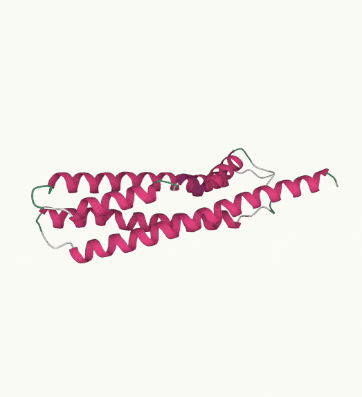</a></td>
    <td style="text-align: center"><a target="_blank" href="./assets/gif/trajectory/6H49_A.mp4">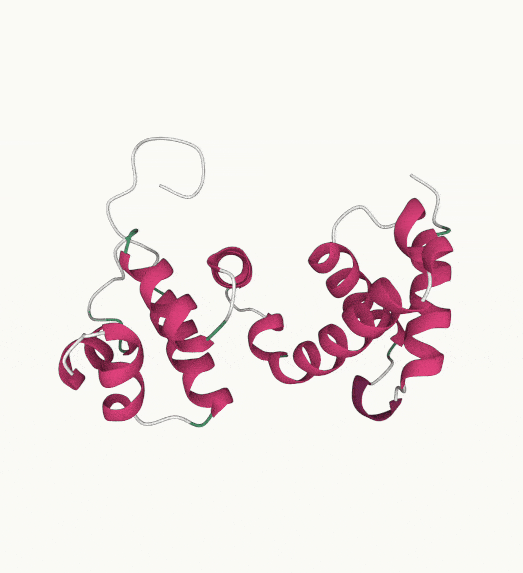</a></td>
    <td style="text-align: center"><a target="_blank" href="./assets/gif/trajectory/6IAH_A.mp4">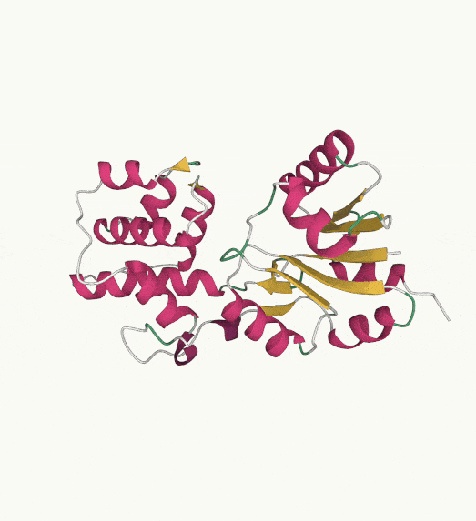</a></td>
  </tr>
  <tr>
    <td style="text-align: center"><b>6JV8_A</b></td>
    <td style="text-align: center"><b>6LUS_A</b></td>
    <td style="text-align: center"><b>6Q9C_A</b></td>
    <td style="text-align: center"><b>7A66_B</b></td>
  </tr>
  <tr>
    <td style="text-align: center"><a target="_blank" href="./assets/gif/trajectory/6JV8_A.mp4">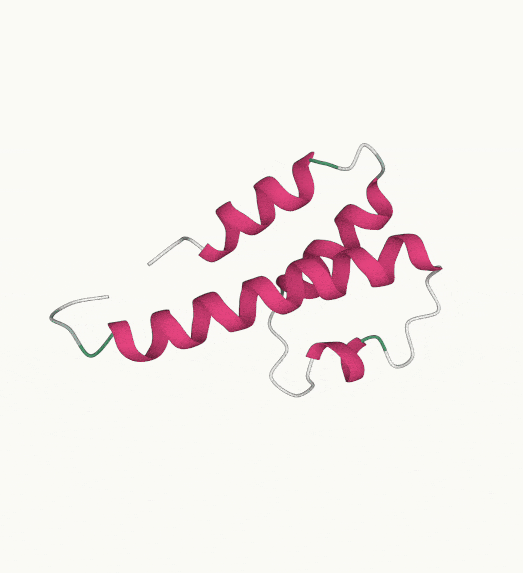</a></td>
    <td style="text-align: center"><a target="_blank" href="./assets/gif/trajectory/6LUS_A.mp4">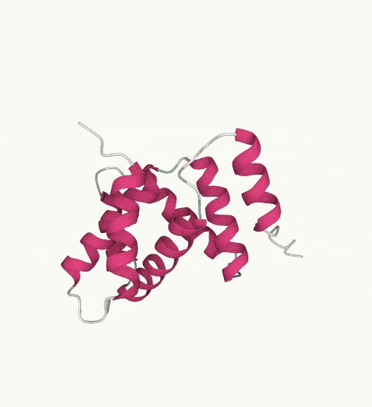</a></td>
    <td style="text-align: center"><a target="_blank" href="./assets/gif/trajectory/6Q9C_A.mp4">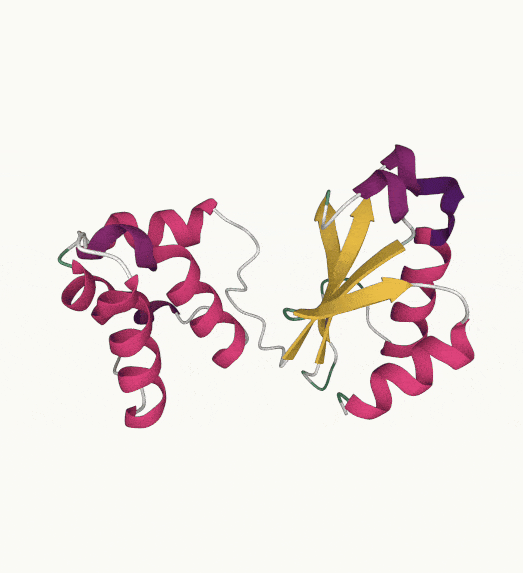</a></td>
    <td style="text-align: center"><a target="_blank" href="./assets/gif/trajectory/7A66_B.mp4">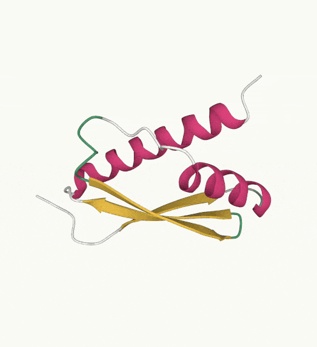</a></td>
  </tr>
</table>

### 🎬 Prediction
<table class="center">
  <tr>
    <td style="text-align: center"><b> </b></td>
    <td style="text-align: center"><b>4UE8_B</b></td>
    <td style="text-align: center"><b>6D7Y_A</b></td>
    <td style="text-align: center"><b>6GUS_A</b></td>
    <td style="text-align: center"><b>6J56_A</b></td>
  </tr>
  <tr>
    <td style="text-align: center">Prediction</td>
    <td style="text-align: center"><a target="_blank" href="./assets/gif/short-term/VS_GT/4UE8_B.mp4">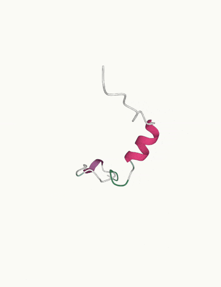</a></td>
    <td style="text-align: center"><a target="_blank" href="./assets/gif/short-term/VS_GT/6D7Y_A.mp4">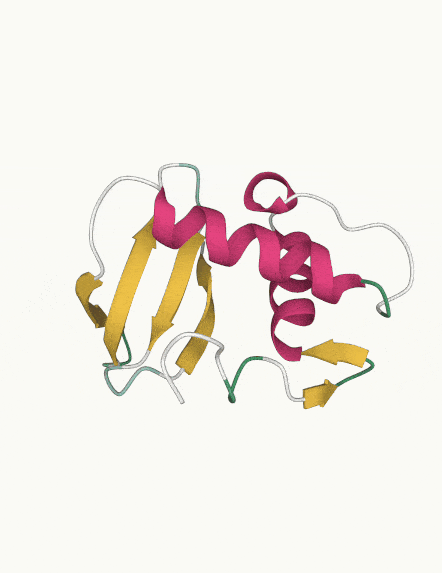</a></td>
    <td style="text-align: center"><a target="_blank" href="./assets/gif/short-term/VS_GT/6GUS_A.mp4">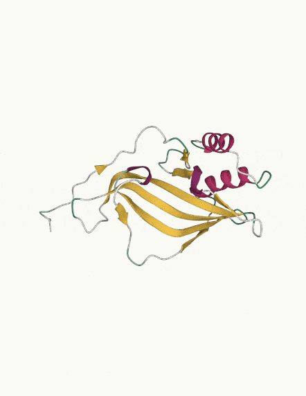</a></td>
    <td style="text-align: center"><a target="_blank" href="./assets/gif/short-term/VS_GT/6J56_A.mp4">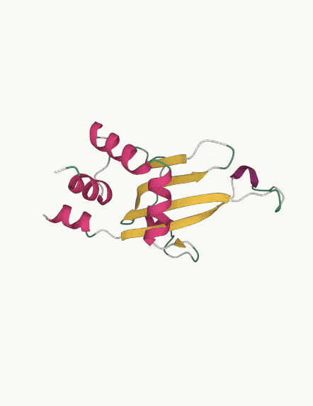</a></td>
  </tr>
  <tr>
    <td style="text-align: center">GT</td>
    <td style="text-align: center"><a target="_blank" href="./assets/gif/short-term/VS_GT/4UE8_B_GT.mp4">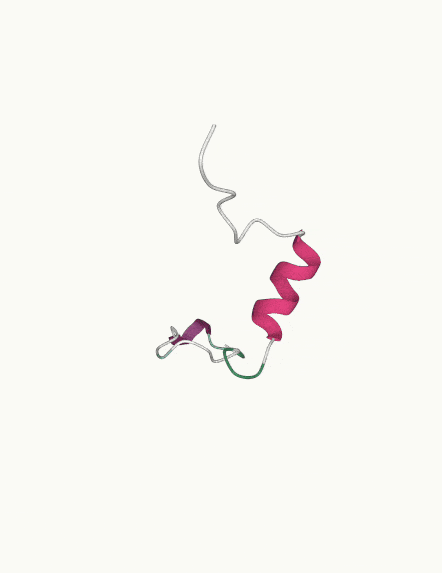</a></td>
    <td style="text-align: center"><a target="_blank" href="./assets/gif/short-term/VS_GT/6D7Y_A_GT.mp4">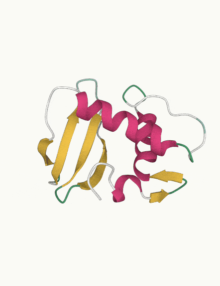</a></td>
    <td style="text-align: center"><a target="_blank" href="./assets/gif/short-term/VS_GT/6GUS_A_GT.mp4">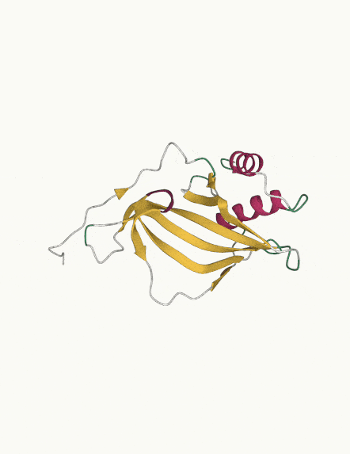</a></td>
    <td style="text-align: center"><a target="_blank" href="./assets/gif/short-term/VS_GT/6J56_A_GT.mp4">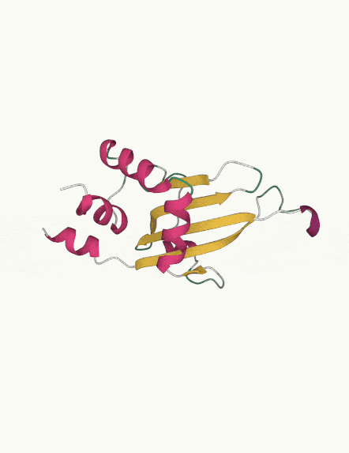</a></td>

  </tr>
</table>

### 🎬 Diffusion Process
<table class="center">
<tr>
    <tr>
      <th class="center" colspan="5" style="text-align:center;">6Q9C_A</th>
    </tr>
    <td style="text-align: center"><a target="_blank" href="./assets/gif/resverse-diff/6Q9C_A_TRAJ_FRAME_99.mp4">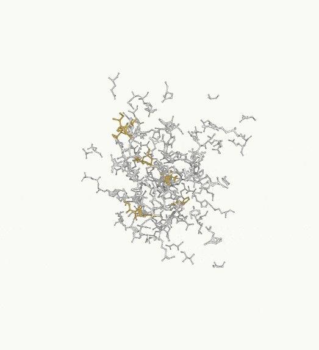</a></td>
    <td style="text-align: center"><a target="_blank" href="./assets/gif/resverse-diff/6Q9C_A_TRAJ_FRAME_10.mp4">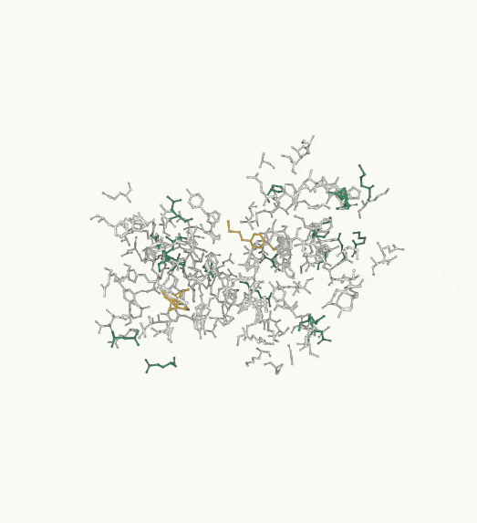</a></td>
    <td style="text-align: center"><a target="_blank" href="./assets/gif/resverse-diff/6Q9C_A_TRAJ_FRAME_2.mp4"></a></td>
    <td style="text-align: center"><a target="_blank" href="./assets/gif/resverse-diff/6Q9C_A_TRAJ_FRAME_1.mp4">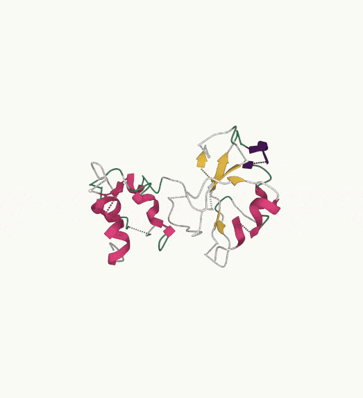</a></td>
    <td style="text-align: center"><a target="_blank" href="./assets/gif/resverse-diff/6Q9C_A_TRAJ_FRAME_0.mp4">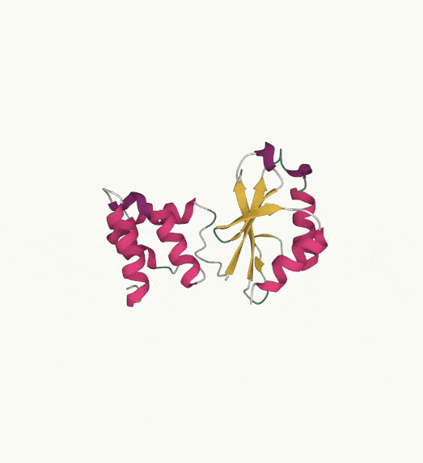</a></td>
  </tr>

  <tr>
      <th class="center" colspan="5" style="text-align:center;">7A66_B</th>
    </tr>
    <td style="text-align: center"><a target="_blank" href="./assets/gif/resverse-diff/7A66_B_TRAJ_FRAME_99.mp4">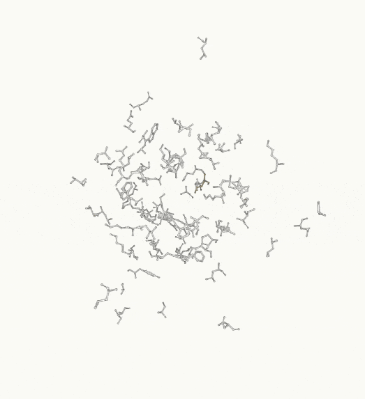</a></td>
    <td style="text-align: center"><a target="_blank" href="./assets/gif/resverse-diff/7A66_B_TRAJ_FRAME_10.mp4">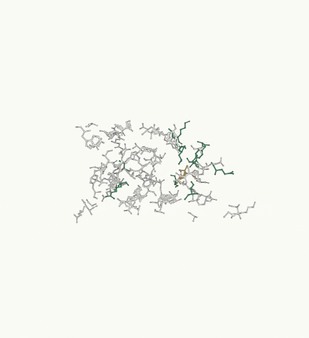</a></td>
    <td style="text-align: center"><a target="_blank" href="./assets/gif/resverse-diff/7A66_B_TRAJ_FRAME_2.mp4">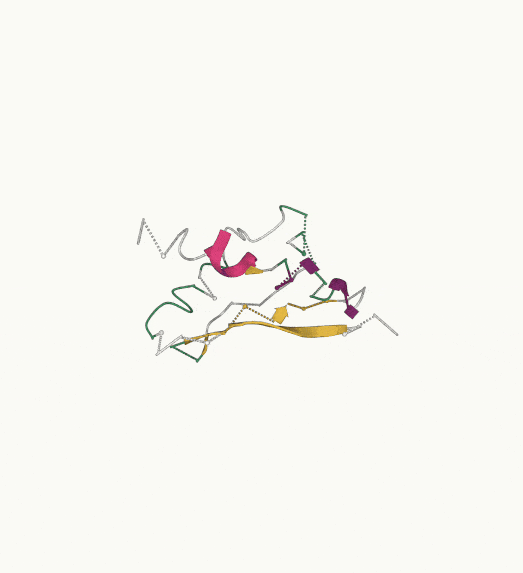</a></td>
    <td style="text-align: center"><a target="_blank" href="./assets/gif/resverse-diff/7A66_B_TRAJ_FRAME_1.mp4"></a></td>
    <td style="text-align: center"><a target="_blank" href="./assets/gif/resverse-diff/7A66_B_TRAJ_FRAME_0.mp4"></a></td>
  </tr>
</table>


## 🔧️ Framework

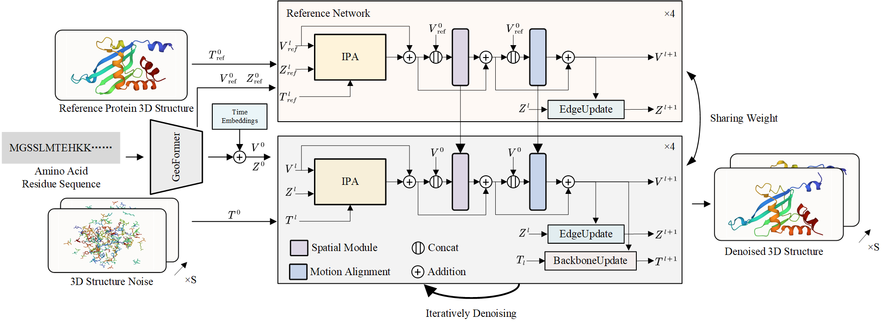

## ⚙️ Installation

- System requirement: Ubuntu 20.04/Ubuntu 22.04
- Tested GPUs: A100

Create conda environment:

```bash
  conda create -n 4d_diffusion python=3.9
  conda activate 4d_diffusion
  pip install -r requirements.txt
```

## 🗝️️ Usage

Before testing or training your cases, please ensure that the working directory is set in `4d_diffusion`:

1. [Data Preparation](#Data-Preparation).
2. [Inference](#Inference).
3. [Training](#Training).


### 📥 Data Preparation
####  Downloading datasets
- To download and preprocess the ATLAS MD trajectory dataset,
  1. Ensure you are in `your dataset root`  and run `bash src/toolbox/download_atlas.sh` from your chosen directory. Ensure you have sufficient disk space available, as the datasets may require over 700GB of storage.
  2. From the `dynamicsPDB` repository root, run:
   ```text
   python src/toolbox/processing_atlas/prep_atlas.py --atlas_dir [DIR] --outdir [DIR] --num_workers [N] --split [csv files]
   ```
  This will preprocess the ATLAS trajectories into `.npz` files.
####  Extract Sequence Embeddings
- Download the OmegaFold weights and install the modified OmegaFold repository.
  ```
  wget https://helixon.s3.amazonaws.com/release1.pt
  git clone https://github.com/bjing2016/OmegaFold
  pip install --no-deps -e OmegaFold
  ```
- Run OmegaFold to make the embeddings:
  ```
  python src/toolbox/processing_atlas/extract_embedding.py --reference_only --out_dir_root=./dataset/embeddings --lm_weights_path [OmegaFold weight] --data_csv_path [data csv]
  ```
  You can also set `num_workers` and `worker_id` to enable parallelized processing.
  ```
  CUDA_VISIBLE_DEVICES=$i python src/toolbox/processing_atlas/extract_embedding.py --reference_only --out_dir_root=./dataset/embeddings --num_workers 8 --worker_id $i &
  ```
  The `data csv` is organized as:
  |name|seqres|seq_len|
  |----|----|----|
  |16pk_A|EKKSIN...|415|
  ...

- These datasets should be organized as follows:

  ```text
  ./dataset/
  |-- atlas/
  |   `-- 16pk_A
  |      |--16pk_A.pdb  
  |      |--16pk_A_prod_R1.tpr 
  |      |--16pk_A_prod_R1_fit.xtc 
  |      |--16pk_A_prod_R2.tpr  
  |      |--16pk_A_prod_R2_fit.xtc  
  |      |--16pk_A_prod_R3.tpr 
  |      |--16pk_A_prod_R3_fit.xtc 
  |      |--README.txt
  |   |-- 1io1_A
  |   |-- 1qau_A
  |   |-- ...
  |-- embeddings
  |   |-- 16pk_A.npz
  |   |-- 1io1_A.npz
  |   |-- 1qau_A.npz
  |   |-- ...
  |-- processed_npz
  |   |-- 16pk_A.npz
  |   |-- 1io1_A.npz
  |   |-- 1qau_A.npz
  |   |-- ...
  |-- train.csv
  |-- test.csv
  ```
  - Optionally, you could consolidate all the information into the relevant `.csv` files and apply filtering based on specific conditions, or you could directly use the provided `train.csv` and `test.csv` files for training and inference in `examples/atlas_visual_se3_filter.csv`.
  
  ```
  python src/toolbox/processing_atlas/merge_csv.py  --csv atlas.csv  --atlas_dir ./dataset/atlas/ --save_path merged.csv --processed_npz ./dataset/processed_npz --embeddings ./dataset/embeddings 

  python src/toolbox/processing_atlas/filter_pdb.py --csv merged.csv --atlas_dir ./dataset/atlas/ --save_path filtered_merged.csv
  ```
  The merged `.csv` file will be formed as:
  |name|seqres|atlas_npz|embed_path|pdb_path|
  |----|----|----|----|----|
  |3a1g_B|GGSMERIK...|.npz|.npz|.npz|
  ...

### 🎮 Inference

Run the `scripts/run_eval_extrapolation.sh` and `scripts/run_eval_visual.sh` as follows:

1. Generate Trajectory

To generate a trajectory, run the following command:

```bash
cd applications/4d_diffusion
bash scripts/run_eval_extrapolation.sh 
```

This will produce:

- `extension_npz`: for atom positions.
- `extension_pdb`: for generated trajectory PDB files.

2. Generate Predictions

If you only want to generate predictions, run:

```bash
cd applications/4d_diffusion
bash scripts/run_eval_visual.sh
```

This will generate:

- `gt`: for ground truth snapshots.
- `sample`: where predictions are stored, including the following files:

  ```
  1. {pdb_name}_aligned.pdb  # prediction aligned with reference
  2. {pdb_name}.pdb           # predicted pdb file
  3. {pdb_name}_first.pdb     # reference pdb file
  4. {pdb_name}_first_motion.pdb  # reference and motion pdb file
  ```

3. Evaluation
To get the evaluation metrix, run the following command:
```bash
cd applications/4d_diffusion
bash scripts/run_eval_metric.sh
```
  This will generate:
  - `{pdb_name}_*.pkl`: contains information for multi-time predictions.
  - `{pdb_name}_*.pdb`: multi-time prediction PDB files.
You can visualize these Generated `.pdb` files  with [PyMol](https://pymol.org/) or [Protein Viewer Extension](https://marketplace.visualstudio.com/items?itemName=ArianJamasb.protein-viewer).

run
```
python print_metric.py --metric_path [metric save path]
```
to get the statistics

4. For more options:

``` 
option:
- data.frame_time: number of predicted frames per inference.
- data.motion_number: number of motion/kinetic frames per inference.
- data.test_csv_path: csv file storing the paths of embedding and position `.npz` files.
- eval.weights_path: model weights (.ckpt).
- eval.mode: mode of inference:
    0 - Single prediction
    1 - Trajectory
    2 - Batch evaluation
- eval.extrapolation_time: repetition of prediction time for generating the trajectory.
- eval.name: directory name to store this inference.
- experiment.base_root: root path to store this inference.
- data.fix_sample_start: the index in the trajectory where the prediction starts.
- data.eval_start_idx & data.eval_end_idx: define the time range for evaluation, the evaluation time is calculated as time = end - start.
```

### 🔥 Training

Follow [Data Preparation](#Data-Preparation) to get data ready, and Update the date `.csv` path in configuration `YAML` files or change it in the training scripts. Start training with the following command:
```shell
cd applications/4d_diffusion
bash scripts/run_train.sh
```
**Note**: Ensure that `CUDA_VISIBLE_DEVICES numbers`,`nproc_per_node`, `experiment.num_gpus`, and `experiment.batch_size` are set to the same value.


## 📝 Citation

If you find our work useful for your research, please consider citing the paper:

```
@misc{cheng20244ddiffusiondynamicprotein,
      title={4D Diffusion for Dynamic Protein Structure Prediction with Reference Guided Motion Alignment}, 
      author={Kaihui Cheng and Ce Liu and Qingkun Su and Jun Wang and Liwei Zhang and Yining Tang and Yao Yao and Siyu Zhu and Yuan Qi},
      year={2024},
      eprint={2408.12419},
      archivePrefix={arXiv},
      primaryClass={cs.LG},
      url={https://arxiv.org/abs/2408.12419}, 
}

```

## 🤗 Acknowledgements

We would like to thank the contributors to the [openfold](https://github.com/aqlaboratory/openfold), [AlphaFlow](https://github.com/bjing2016/alphaflow), [EigenFold](https://github.com/bjing2016/EigenFold), and [SE3-Diffusion](https://github.com/jasonkyuyim/se3_diffusion) repositories, for their open research and exploration.

If we missed any open-source projects or related articles, we would like to complement the acknowledgement of this specific work immediately.

