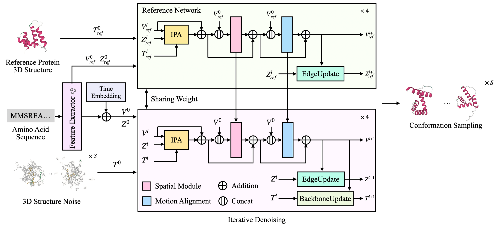

<h1 align='center'>A Geometric Constrained 4D Diffusion Framework for Dynamic Protein Pathway Prediction and Conformation Sampling</h1>

<div align='center'>
    <a href='https://github.com/yh-pengtu' target='_blank'>Peng Tu</a><sup>1†</sup>&emsp;
    <a target='_blank'>Yingxu Wang</a><sup>1,3†</sup>&emsp;
    <a href='https://github.com/Kaihui-Cheng' target='_blank'>Kaihui Cheng</a><sup>2†</sup>&emsp;
    <a href='https://github.com/wanggaa' target='_blank'>Jun Wang</a><sup>1†</sup>&emsp;
    <a href='https://github.com/zqcai19' target='_blank'>Zhiqiang Cai</a><sup>1†</sup>&emsp;
    <a href='https://github.com/cnexah' target='_blank'>Ce Liu</a><sup>1†</sup>&emsp;

</div>
<div align='center'>
    <a href='https://github.com/subazinga' target='_blank'>Qingkun Su</a><sup>1</sup>&emsp;
    <a href='https://github.com/AricGamma' target='_blank'>Liwei Zhang</a><sup>1</sup>&emsp;
    <a target='_blank'>Yuan Cheng</a><sup>2,1</sup>&emsp;
    <a href='https://sites.google.com/site/zhusiyucs/home' target='_blank'>Siyu Zhu</a><sup>2,1*</sup>&emsp;
    <a target='_blank'>Yuan Qi</a><sup>2,1*</sup>&emsp;
</div>

<div align='center'>
    <sup>1</sup>Shanghai Academy of AI for Science&emsp; <sup>2</sup>Fudan University&emsp;  <sup>3</sup>MBZUAI
</div>

<div align='center'>
    <sup>†</sup>Equal Contribution&emsp;
    <sup>*</sup>Corresponding Author
</div>

## 🔧️ Framework



## ⚙️ Installation

- System requirement: Ubuntu 20.04/Ubuntu 22.04
- Tested GPUs: A100

Create conda environment:

```bash
conda env create -f environment.yml
conda activate 4d_diffusion
```

### 📥 Data Preparation
####  Downloading Datasets
Ensure you are in `conformation_sampling` repository root.
1. To download the ATLAS MD trajectory dataset, run:
```text
bash src/toolbox/processing_atlas/download_atlas.sh
```

2. To preprocess the dataset, run:
```text
src/toolbox/processing_atlas/prep_atlas.py --atlas_dir data/atlas --outdir data/atlas_process --split test_data.csv --traj_id 1
src/toolbox/processing_atlas/prep_atlas.py --atlas_dir data/atlas --outdir data/atlas_process2 --split test_data.csv --traj_id 2
src/toolbox/processing_atlas/prep_atlas.py --atlas_dir data/atlas --outdir data/atlas_process3 --split test_data.csv --traj_id 3
```
This will preprocess the ATLAS trajectories into `.npz` files.

####  Extract Sequence Embeddings
We use openfold to extract sequence embeddings.
- [Install openfold](https://github.com/aqlaboratory/openfold/blob/main/docs/source/original_readme.md#installation-linux) and [download alignment databases](https://github.com/aqlaboratory/openfold/blob/main/docs/source/original_readme.md#download-alignment-databases).

- Generate fasta files to facilitate subsequent AlphaFold feature generation:
```text
python src/toolbox/processing_atlas/genfasta.py
```

- Extract MSA features:
```text
bash src/toolbox/processing_atlas/dpdb.sh
```

- Extract AlphaFold features:
```text
bash src/toolbox/processing_atlas/af2_atlas.sh
```

- Calculate distances between frames to obtain a distance matrix:
```text
python src/toolbox/processing_atlas/compress_rmsd.py
```

- These datasets should be organized as follows:

```text
./data/
|-- atlas/
|   `-- 6in7_A/
|      |-- 6in7_A.pdb
|      |-- 6in7_A_prod_R1.tpr
|      |-- 6in7_A_prod_R1_fit.xtc
|      |-- 6in7_A_prod_R2.tpr
|      |-- 6in7_A_prod_R2_fit.xtc
|      |-- 6in7_A_prod_R3.tpr
|      |-- 6in7_A_prod_R3_fit.xtc
|      |-- README.txt
|   |-- 6jv8_A
|   |-- 6lus_A
|   |-- ...
|-- atlas_process
|   |-- 6in7_A.npz
|   |-- 6jv8_A.npz
|   |-- 6lus_A.npz
|   |-- ...
|-- atlas_process2
|-- atlas_process3
|-- af2_feat
|   |-- 6in7_A.npz
|   |-- 6jv8_A.npz
|   |-- 6lus_A.npz
|   |-- ...
|-- dist_matrix
|   |-- 6in7_A.npz.npy
|   |-- 6jv8_A.npz.npy
|   |-- 6lus_A.npz.npy
|   |-- ...
```

### 🎮 Inference

Run the command as follows:
```shell
bash run_eval.sh
```
The weights can be downloaded from our [Code Ocean capsule](https://codeocean.com/capsule/3813132/tree/v1).

### 🔥 Training

Follow [Data Preparation](#-data-preparation) to get the training data ready, and start training with the following command:
```shell
bash run_train.sh
```

## 🤗 Acknowledgements

We would like to thank the contributors to the [openfold](https://github.com/aqlaboratory/openfold), [AlphaFlow](https://github.com/bjing2016/alphaflow), [EigenFold](https://github.com/bjing2016/EigenFold), and [SE3-Diffusion](https://github.com/jasonkyuyim/se3_diffusion) repositories, for their open research and exploration.

If we missed any open-source projects or related articles, we would like to complement the acknowledgement of this specific work immediately.

